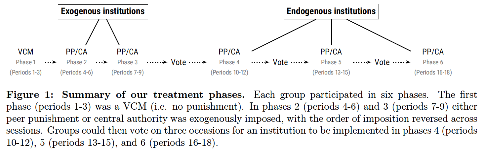
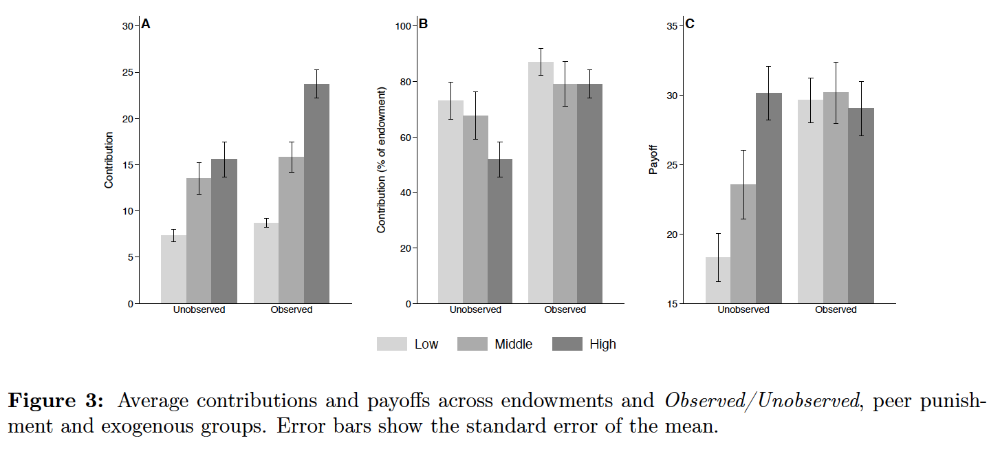

# InstitutionalChoice

Data and replication files for De Geest, Lawrence R., and David C. Kingsley. "Endowment Heterogeneity, Incomplete Information & Institutional Choice in Public Good Experiments." Journal of Behavioral and Experimental Economics (2019): 101478. [(Link)](https://www.sciencedirect.com/science/article/pii/S2214804319300424?dgcid=author)

